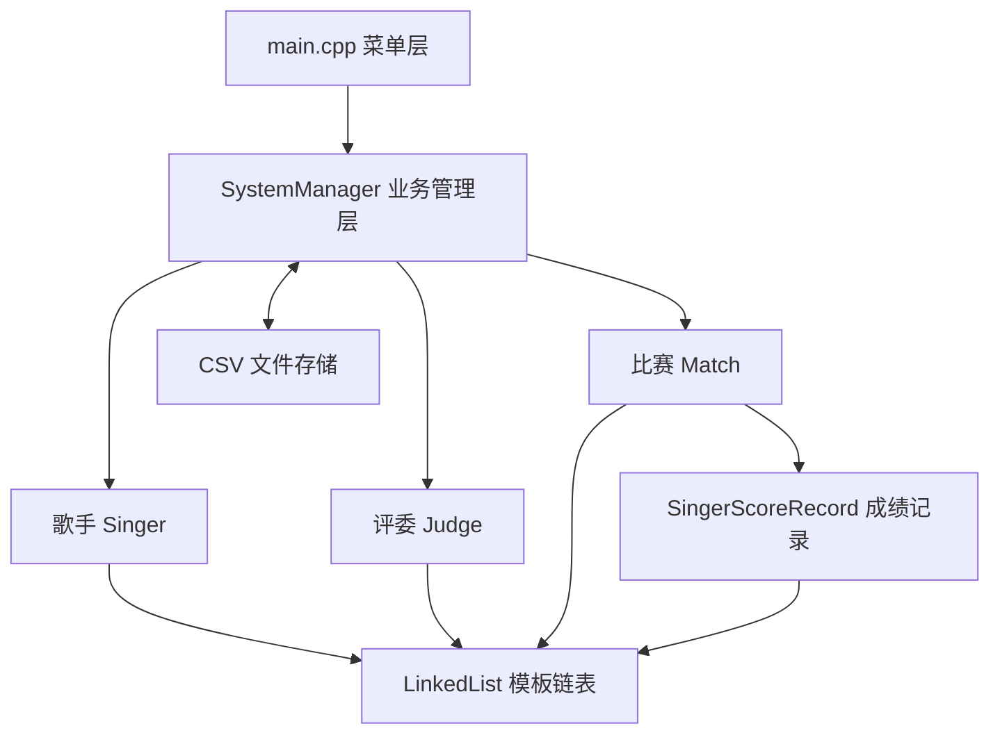

# 歌手比赛管理系统

基于 C++17 和自定义链表实现的命令行歌手比赛管理系统。系统覆盖歌手、评委、比赛场次、现场打分、成绩排名、跨场次查询和 CSV 数据持久化等完整业务流程。

本文档不仅介绍如何构建和使用项目，还结合仓库中的真实源代码说明各项功能的具体实现方式。

## 目录

- [功能概览](#功能概览)
- [项目结构](#项目结构)
- [源码文件说明](#源码文件说明)
- [总体设计](#总体设计)
- [核心功能与源码实现](#核心功能与源码实现)
- [数据文件设计](#数据文件设计)
- [构建与运行](#构建与运行)
- [操作流程](#操作流程)
- [注意事项](#注意事项)

## 功能概览

| 模块 | 功能 | 主要实现 |
| --- | --- | --- |
| 歌手管理 | 新增、修改、删除、浏览、姓名模糊查询 | `addSinger`、`modifySinger`、`deleteSinger`、`searchSinger` |
| 评委管理 | 新增、修改、删除、浏览、姓名模糊查询 | `addJudge`、`modifyJudge`、`deleteJudge`、`searchJudge` |
| 场次管理 | 新建、修改日期、删除、浏览比赛 | `createMatch`、`modifyMatch`、`deleteMatch`、`viewMatches` |
| 比赛运行 | 选择歌手与评委、录入评分、计算成绩 | `operateMatch` |
| 成绩展示 | 总分排序、指定评委评分排序、十佳名单 | `sortT`、`sortS`、`MatchDetails` |
| 综合查询 | 查询歌手历次成绩、评委历次打分 | `querySinger`、`queryJudge` |
| 文件管理 | 保存和恢复歌手、评委、比赛及评分 | `saveData`、`loadData` |
| 输入校验 | 校验编号、性别、日期和分数 | `Validator` |

## 项目结构

```text
SingerManagerSystem/
├── CMakeLists.txt
├── README.md
├── include/
│   ├── Person.h
│   ├── Singer.h
│   ├── Judge.h
│   ├── SingerScoreRecord.h
│   ├── Match.h
│   ├── LinkedList.h
│   ├── Validator.h
│   └── SystemManager.h
├── src/
│   ├── main.cpp
│   └── SystemManager.cpp
├── data/
│   ├── singers.csv
│   ├── judges.csv
│   └── matches_detail.csv
└── docs/
    └── 歌手比赛系统_课程设计报告.docx
```

## 源码文件说明

| 源文件 | 职责 |
| --- | --- |
| [src/main.cpp](src/main.cpp) | 程序入口、主菜单与各级子菜单 |
| [src/SystemManager.cpp](src/SystemManager.cpp) | 业务功能、计分排序、查询及文件读写 |
| [include/SystemManager.h](include/SystemManager.h) | 系统管理器接口和三类核心数据集合 |
| [include/Person.h](include/Person.h) | 歌手与评委的公共人员基类 |
| [include/Singer.h](include/Singer.h) | 歌手模型及获奖信息 |
| [include/Judge.h](include/Judge.h) | 评委模型及专业头衔 |
| [include/Match.h](include/Match.h) | 比赛场次、参赛人员、评分记录和十佳名单 |
| [include/SingerScoreRecord.h](include/SingerScoreRecord.h) | 单个歌手的评委评分、总分、平均分和名次 |
| [include/LinkedList.h](include/LinkedList.h) | 自定义模板单链表及深拷贝 |
| [include/Validator.h](include/Validator.h) | 控制台输入合法性校验 |

## 总体设计

系统由菜单层、业务管理层、数据模型层和文件存储层组成：



`main.cpp` 负责接收菜单编号，不直接处理业务数据；`SystemManager` 统一协调增删改查、比赛和持久化；所有集合都由 `LinkedList<T>` 保存。

## 核心功能与源码实现

以下片段来自项目实际实现。为突出关键逻辑，较长函数省略了部分提示输出，并统一了少量局部变量名；每节均提供完整源文件链接，实际行为以仓库源码为准。

### 1. 菜单如何调度业务

程序启动时先调用 `loadData()` 恢复数据，然后不断显示主菜单。用户选择退出时调用 `saveData()`，保证本次操作写入文件。

核心源码摘自 [src/main.cpp](src/main.cpp)：

```cpp
int main() {
    SystemManager manager;
    manager.loadData();

    int choice;
    while (true) {
        MainMenu();
        cin >> choice;

        if (cin.fail()) {
            cin.clear();
            cin.ignore(10000, '\n');
            cout << "【输入错误】请输入有效的数字编号！\n";
            continue;
        }

        switch (choice) {
            case 1: singerMenu(manager); break;
            case 2: judgeMenu(manager); break;
            case 3: matchMenu(manager); break;
            case 4: manager.operateMatch(); break;
            case 5: manager.MatchDetails(); break;
            case 6: queryMenu(manager); break;
            case 0:
                manager.saveData();
                return 0;
            default:
                cout << "【输入错误】请在 0-6 之间进行选择。\n";
        }
    }
}
```

各个子菜单使用同样的循环与 `switch` 结构。例如歌手菜单只负责把操作转发给 `SystemManager`，因此界面控制与业务实现保持分离。

### 2. 歌手和评委如何复用公共信息

`Person` 保存编号、姓名、性别、出生日期、地址和组别。歌手与评委通过公开继承复用这些字段，并分别增加 `awards` 和 `title`。

核心源码摘自 [include/Person.h](include/Person.h)、[include/Singer.h](include/Singer.h) 和 [include/Judge.h](include/Judge.h)：

```cpp
class Person {
public:
    int id;
    string name;
    string gender;
    string birthday;
    string address;
    string group;

    Person() : id(0) {}
    Person(int id, string name, string gender, string birthday,
           string address, string group)
        : id(id), name(name), gender(gender), birthday(birthday),
          address(address), group(group) {}
};

class Singer : public Person {
public:
    string awards;

    Singer(int id, string name, string gender, string birthday,
           string address, string group, string awards)
        : Person(id, name, gender, birthday, address, group),
          awards(awards) {}
};

class Judge : public Person {
public:
    string title;

    Judge(int id, string name, string gender, string birthday,
          string address, string group, string title)
        : Person(id, name, gender, birthday, address, group),
          title(title) {}
};
```

这种设计避免在 `Singer` 和 `Judge` 中重复定义人员基础字段，同时保留两类角色各自的业务属性。

### 3. 自定义模板链表如何存储数据

系统没有直接使用 `std::list`，而是通过模板实现单链表。节点保存数据与后继指针，链表保存头指针和元素数量。

核心源码摘自 [include/LinkedList.h](include/LinkedList.h)：

```cpp
template <typename T>
struct Node {
    T data;
    Node* next;

    Node(const T& val) : data(val), next(NULL) {}
};

template <typename T>
class LinkedList {
private:
    Node<T>* head;
    int size;

public:
    LinkedList() : head(NULL), size(0) {}
    ~LinkedList() { clear(); }

    void append(const T& val) {
        Node<T>* newNode = new Node<T>(val);
        if (head == NULL) {
            head = newNode;
        } else {
            Node<T>* t = head;
            while (t->next != NULL) {
                t = t->next;
            }
            t->next = newNode;
        }
        size++;
    }

    void clear() {
        Node<T>* current = head;
        while (current != NULL) {
            Node<T>* next = current->next;
            delete current;
            current = next;
        }
        head = NULL;
        size = 0;
    }
};
```

`append` 从头节点遍历到链尾后追加新节点；`clear` 逐个释放动态分配的节点；析构函数调用 `clear`，避免链表销毁时遗留节点内存。

比赛对象和成绩记录中包含嵌套链表，因此链表还实现了深拷贝：

```cpp
LinkedList(const LinkedList<T>& other) : head(NULL), size(0) {
    Node<T>* current = other.head;
    while (current != NULL) {
        append(current->data);
        current = current->next;
    }
}

LinkedList<T>& operator=(const LinkedList<T>& other) {
    if (this != &other) {
        clear();
        Node<T>* current = other.head;
        while (current != NULL) {
            append(current->data);
            current = current->next;
        }
    }
    return *this;
}
```

深拷贝使 `Match` 或 `SingerScoreRecord` 被复制时拥有独立节点，防止多个对象共享同一组节点并发生重复释放。

### 4. 系统管理器如何组织全部数据

`SystemManager` 持有三个顶层链表，分别保存全部歌手、全部评委和全部比赛：

```cpp
class SystemManager {
public:
    LinkedList<Singer> allSingers;
    LinkedList<Judge> allJudges;
    LinkedList<Match> allMatches;

    void addSinger();
    void modifySinger();
    void deleteSinger();
    Singer* findSinger(int id);

    void addJudge();
    void modifyJudge();
    void deleteJudge();
    Judge* findJudge(int id);

    void createMatch();
    void operateMatch();
    void MatchDetails();

    void saveData();
    void loadData();
};
```

每场 `Match` 又保存本场歌手、评委、完整成绩和十佳记录：

```cpp
class Match {
public:
    int matchId;
    string matchDate;
    LinkedList<Singer> Singers;
    LinkedList<Judge> Judges;
    LinkedList<SingerScoreRecord> scoreRecords;
    LinkedList<SingerScoreRecord> topTen;
};
```

因此，顶层档案与单场比赛快照相互独立，历史比赛可以保留当时的参赛人员和评分明细。

### 5. 增删改查如何实现

新增数据时，系统先校验 ID，再调用 `findSinger` 检查是否重复。创建对象后追加到链表，并立即保存。

核心源码摘自 [src/SystemManager.cpp](src/SystemManager.cpp)：

```cpp
void SystemManager::addSinger() {
    int id = Validator::validId();
    if (findSinger(id) != NULL) {
        cout << "[错误] 该编号的歌手已存在！\n";
        return;
    }

    string name, gender, birthday, addr, group, awards;
    cin >> name;
    gender = Validator::validGender();
    birthday = Validator::validDate();
    cin >> addr >> group >> awards;

    allSingers.append(
        Singer(id, name, gender, birthday, addr, group, awards)
    );
    saveData();
}
```

精确查找通过遍历链表比较编号，找到后返回节点中对象的地址：

```cpp
Singer* SystemManager::findSinger(int id) {
    Node<Singer>* current = allSingers.getHead();
    while (current != NULL) {
        if (current->data.id == id) {
            return &(current->data);
        }
        current = current->next;
    }
    return NULL;
}
```

删除操作遍历时同时保存当前节点和前驱节点，再交给 `removeNode` 调整链表指针。姓名查询使用 `string::find` 实现关键词匹配：

```cpp
if (current->data.name.find(keywords) != string::npos) {
    cout << current->data.id << " | " << current->data.name << endl;
}
```

评委管理与歌手管理采用相同流程；修改功能先按 ID 获取对象指针，再直接更新对象字段。

### 6. 输入数据如何校验

`Validator` 使用静态方法集中校验控制台输入。例如分数必须在 `0～100` 之间，编号必须为正整数：

核心源码摘自 [include/Validator.h](include/Validator.h)：

```cpp
static double validScore() {
    double score;
    while (true) {
        cin >> score;
        if (cin.fail() || score < 0.0 || score > 100.0) {
            cin.clear();
            cin.ignore(10000, '\n');
            cout << "分数必须是 0~100 之间的数字，请重新输入：";
        } else {
            return score;
        }
    }
}

static int validId() {
    int id;
    while (true) {
        cin >> id;
        if (cin.fail() || id <= 0) {
            cin.clear();
            cin.ignore(10000, '\n');
            cout << "编号必须是大于 0 的正整数，请重新输入：";
        } else {
            return id;
        }
    }
}
```

日期校验会分别检查年份、月份和日期，并根据月份及闰年规则计算当月最大天数，最后格式化为 `YYYY-MM-DD`。

### 7. 比赛打分如何计算

`operateMatch()` 的执行过程如下：

1. 根据场次 ID 查找比赛。
2. 输入评委人数并从评委档案中选择本场评委。
3. 输入参赛人数并从歌手档案中选择参赛歌手。
4. 为每位歌手依次录入每位评委的评分。
5. 根据评委人数选择计分规则。
6. 按总分降序排序、生成名次和十佳名单。
7. 调用 `saveData()` 保存比赛结果。

每条成绩使用 `SingerScoreRecord` 保存：

```cpp
struct Score {
    int id;
    double score;
};

class SingerScoreRecord {
public:
    int singerId;
    string singerName;
    LinkedList<Score> scoreList;
    double totalScore;
    double averageScore;
    int rank;
};
```

评分录入与最高分、最低分统计的源码如下：

```cpp
double maxScore = -1.0;
double minScore = 101.0;
double sum = 0.0;

Node<Judge>* judge = match->Judges.getHead();
while (judge != NULL) {
    double score = Validator::validScore();

    record.scoreList.append(Score(judge->data.id, score));
    sum += score;

    if (score > maxScore) maxScore = score;
    if (score < minScore) minScore = score;

    judge = judge->next;
}
```

计分规则由评委人数决定：

```cpp
if (judgeCount >= 3) {
    record.totalScore = sum - maxScore - minScore;
    record.averageScore = record.totalScore / (judgeCount - 2);
} else {
    record.totalScore = sum;
    record.averageScore = record.totalScore / judgeCount;
}
```

- 评委少于 3 人：保留全部评分。
- 评委不少于 3 人：去掉一个最高分和一个最低分。
- 排名使用 `totalScore`，`averageScore` 同时保存在成绩对象和比赛数据文件中。

### 8. 成绩如何排序并生成十佳

`sortT` 使用冒泡排序比较相邻记录。如果前一个总分较低，就交换两条成绩数据；`lastNode` 缩小下一轮比较范围，若一轮没有交换则提前结束。

核心源码摘自 [src/SystemManager.cpp](src/SystemManager.cpp)：

```cpp
void SystemManager::sortT(LinkedList<SingerScoreRecord>& list) {
    if (list.getSize() < 2) return;

    Node<SingerScoreRecord>* lastNode = NULL;
    for (Node<SingerScoreRecord>* i = list.getHead();
         i != NULL; i = i->next) {
        Node<SingerScoreRecord>* changed = NULL;

        for (Node<SingerScoreRecord>* j = list.getHead();
             j->next != lastNode; j = j->next) {
            if (j->data.totalScore < j->next->data.totalScore) {
                swapRecordData(j->data, j->next->data);
                changed = j->next;
            }
        }

        if (changed == NULL) break;
        lastNode = changed;
    }
}
```

排序完成后，系统从链表头开始依次设置名次，并复制前 10 条记录：

```cpp
sortT(match->scoreRecords);
match->topTen.clear();

Node<SingerScoreRecord>* current = match->scoreRecords.getHead();
int currentRank = 1;
while (current != NULL) {
    current->data.rank = currentRank;
    if (currentRank <= 10) {
        match->topTen.append(current->data);
    }
    currentRank++;
    current = current->next;
}
```

`sortS` 的结构与 `sortT` 相同，但比较前会从两位歌手的 `scoreList` 中查找指定评委 ID 对应的分数，从而实现“按某位评委评分排序”。

### 9. 跨场次查询如何实现

歌手历史成绩查询使用两层遍历：

1. 外层遍历 `allMatches` 中的全部比赛。
2. 内层遍历每场比赛的 `scoreRecords`。
3. 当 `singerId` 匹配时输出场次、总分和名次。

评委历史打分查询增加第三层遍历，在每条歌手成绩的 `scoreList` 中查找评委 ID，并输出该评委对不同歌手的具体评分。

### 10. CSV 数据如何保存与恢复

`saveData` 和 `loadData` 是统一入口：

```cpp
void SystemManager::saveData() {
    saveSingers();
    saveJudges();
    saveMatches();
}

void SystemManager::loadData() {
    loadSingers();
    loadJudges();
    loadMatches();
}
```

歌手和评委使用一行一条记录的普通 CSV。保存歌手的核心源码如下：

```cpp
void SystemManager::saveSingers() {
    ofstream fout("singers.csv", ios::out);
    Node<Singer>* current = allSingers.getHead();

    while (current != NULL) {
        fout << current->data.id << ","
             << current->data.name << ","
             << current->data.gender << ","
             << current->data.birthday << ","
             << current->data.address << ","
             << current->data.group << ","
             << current->data.awards << "\n";
        current = current->next;
    }
}
```

读取时通过 `getline` 按逗号切分字段，再用 `stoi` 将编号转换为整数并重建对象：

```cpp
getline(stream, id, ',');
getline(stream, name, ',');
getline(stream, gender, ',');
getline(stream, birthday, ',');
getline(stream, address, ',');
getline(stream, group, ',');
getline(stream, awards, '\n');

Singer singer(stoi(id), name, gender, birthday, address, group, awards);
allSingers.append(singer);
```

比赛中存在多层嵌套数据，因此 `matches_detail.csv` 使用区段标记。单场比赛的格式如下：

```text
[MATCH]
场次ID,比赛日期
[SINGERS]
歌手数量
歌手记录...
[JUDGES]
评委数量
评委记录...
[SCORERECORDS]
成绩数量
歌手ID,姓名,总分,平均分,名次,评委ID:分数|评委ID:分数
[TOPTEN]
十佳数量
十佳记录...
```

`loadMatches()` 按区段顺序读取数量和对应记录，并逐层恢复 `Match`、`SingerScoreRecord` 与 `Score` 链表。

## 数据文件设计

| 文件 | 字段或内容 |
| --- | --- |
| `singers.csv` | 编号、姓名、性别、出生日期、地址、组别、获奖信息 |
| `judges.csv` | 编号、姓名、性别、出生日期、地址、组别、专业头衔 |
| `matches_detail.csv` | 场次、参赛歌手、参评评委、逐项评分、名次、十佳名单 |

程序使用相对路径打开文件，因此会在**当前工作目录**中读写这三个文件，而不是自动定位仓库中的 `data/`。

## 构建与运行

### 环境要求

- CMake 3.20 或更高版本
- 支持 C++17 的 GCC、Clang 或 MSVC
- 支持中文显示的终端

### Windows

在项目根目录构建：

```powershell
cmake -S . -B build
cmake --build build
```

复制示例数据并从可执行文件目录运行：

```powershell
Copy-Item data\*.csv build\
Set-Location build
.\SingerManagerSystem.exe
```

使用 Visual Studio 多配置生成器时：

```powershell
cmake --build build --config Release
Copy-Item data\*.csv build\Release\
Set-Location build\Release
.\SingerManagerSystem.exe
```

### Linux/macOS

```bash
cmake -S . -B build
cmake --build build
cp data/*.csv build/
cd build
./SingerManagerSystem
```

## 操作流程

1. 启动程序，系统从当前工作目录加载 CSV 数据。
2. 在“歌手信息管理”中维护歌手档案。
3. 在“评委信息管理”中维护评委档案。
4. 在“比赛场次管理”中新建比赛并设置日期。
5. 选择“模拟比赛运行”，指定评委和歌手后依次打分。
6. 在“比赛赛况查看”中查看总分、名次和评分明细。
7. 在“综合查询中心”中查询歌手或评委的跨场次记录。
8. 输入 `0` 保存全部数据并退出。

## 注意事项

- 程序会在新增、修改、删除、比赛结束及正常退出时写入 CSV，请先复制示例数据再进行实验。
- CSV 使用英文逗号分隔，文本字段中不要输入英文逗号，否则会影响后续解析。
- `matches_detail.csv` 包含固定区段与数量信息，建议通过程序维护，不要随意调整区段顺序。
- 中文源文件和数据文件应使用当前编译器与终端能够正确识别的编码。
- 完整实现以仓库中 [include/](include/) 和 [src/](src/) 目录下的源文件为准。
